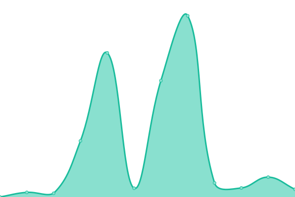

# [📈 Live Status](https://uptime.technoogies.com): <!--live status--> **🟧 Partial outage**

This repository contains the open-source uptime monitor and status page for [technoogies](https://uptime.technoogies.com), powered by [Upptime](https://github.com/upptime/upptime).

With [Upptime](https://upptime.js.org), you can get your own unlimited and free uptime monitor and status page, powered entirely by a GitHub repository. We use [Issues](https://github.com/technoogies/upptime/issues) as incident reports, [Actions](https://github.com/technoogies/upptime/actions) as uptime monitors, and [Pages](https://uptime.technoogies.com) for the status page.

<!--start: status pages-->
<!-- This summary is generated by Upptime (https://github.com/upptime/upptime) -->
<!-- Do not edit this manually, your changes will be overwritten -->
<!-- prettier-ignore -->
| URL | Status | History | Response Time | Uptime |
| --- | ------ | ------- | ------------- | ------ |
|  [Test Control (Goog)](https://google.com) | 🟩 Up | [test-control-goog.yml](https://github.com/technoogies/upptime/commits/master/history/test-control-goog.yml) | 

 228ms
     
 | 

<a href="https://uptime.technoogies.com/history/test-control-goog">100.00%</a>
    

|  [Technoogies](https://technoogies.com) | 🟩 Up | [technoogies.yml](https://github.com/technoogies/upptime/commits/master/history/technoogies.yml) | 

 4600ms
     
 | 

<a href="https://uptime.technoogies.com/history/technoogies">97.92%</a>
    

|  [Swet Inc](https://www.swetinc.com) | 🟩 Up | [swet-inc.yml](https://github.com/technoogies/upptime/commits/master/history/swet-inc.yml) | 

 2553ms
     
 | 

<a href="https://uptime.technoogies.com/history/swet-inc">100.00%</a>
    

|  [It's For Africa!](https://itsforafrica.org) | 🟩 Up | [it-s-for-africa.yml](https://github.com/technoogies/upptime/commits/master/history/it-s-for-africa.yml) | 

 800ms
     
 | 

<a href="https://uptime.technoogies.com/history/it-s-for-africa">97.11%</a>
    

|  [ComeOnAndFeedMe](https://comeonandfeedme.com) | 🟥 Down | [come-on-and-feed-me.yml](https://github.com/technoogies/upptime/commits/master/history/come-on-and-feed-me.yml) | 

 3395ms
     
 | 

<a href="https://uptime.technoogies.com/history/come-on-and-feed-me">100.00%</a>
    

|  [Tru Themes](https://truthemes.com) | 🟩 Up | [tru-themes.yml](https://github.com/technoogies/upptime/commits/master/history/tru-themes.yml) | 

 1617ms
     
 | 

<a href="https://uptime.technoogies.com/history/tru-themes">100.00%</a>
    

|  [Oy 2 Us](https://oy2.us) | 🟩 Up | [oy-2-us.yml](https://github.com/technoogies/upptime/commits/master/history/oy-2-us.yml) | 

 112ms
     
 | 

<a href="https://uptime.technoogies.com/history/oy-2-us">100.00%</a>
    

|  [Tru Memes](https://trumemes.com) | 🟩 Up | [tru-memes.yml](https://github.com/technoogies/upptime/commits/master/history/tru-memes.yml) | 

 1999ms
     
 | 

<a href="https://uptime.technoogies.com/history/tru-memes">100.00%</a>
    

<!--end: status pages-->

[**Visit our status website →**](https://uptime.technoogies.com)

## 📄 License

- Powered by: [Upptime](https://github.com/upptime/upptime)
- Code: [MIT](./LICENSE) © [technoogies](https://uptime.technoogies.com)
- Data in the `./history` directory: [Open Database License](https://opendatacommons.org/licenses/odbl/1-0/)
